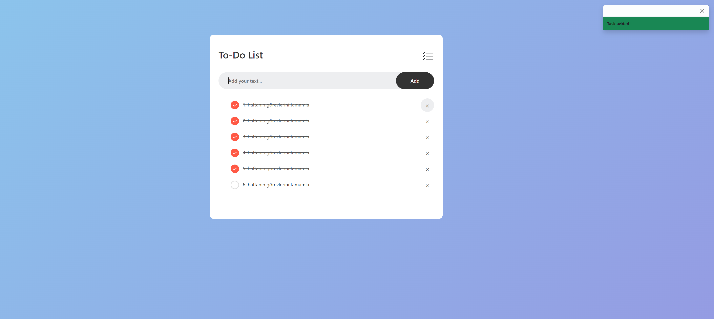

# Projeye ait ekran goruntusu:

---

## To-Do List JavaScript Odevi

Bu proje, kullanicilarin gunluk islerini takip etmelerini saglayan basit ve kullanisli bir yapilacaklar listesi uygulamasidir. Kullanicilar, listeye yeni gorevler ekleyebilir, tamamlanan gorevleri isaretleyebilir ve tamamlanmis gorevleri listeden kaldirabilir.

---

### Ana Ozellikleri

**Gorev Ekleme:** Kullanici, girdi alanina yeni bir gorev yazarak ve "Ekle" butonuna veya "Enter" tusuna basarak listeye kolayca gorev ekleyebilir.

**Gorev Tamamlama:** Her bir gorevin uzerine tiklandiginda gorev "tamamlandi" olarak isaretlenir ve gorsel olarak vurgulanir (ornegin, uzeri cizilir ve onay isareti gosterilir.).

**Gorev Silme:** Her gorevin yaninda bulunan "X" butonuna tiklanarak gorev listede kalici olarak silinir.

**Bildirimler (Toast Mesajlari):** Kullanici etkilesimlerine gore (ornegin, bos gorev ekleyemezsin) gorsel bildirimler gosterilir.

---

### Kullanilan Teknolojiler

**HTML5:** Sayfanin yapisini olusturmak icin kullanildi.

**CSS3:** Sayfanin gorsel tasarimini olusturmak icin kullanildi.

**JavaScript:** Uygulamanin interaktif ozelliklerini saglamak icin kullanildi.

**Bootstrap (5.2.3):** Ikonlari ve bildirim ozellikleri icin kullanildi.

---

### Yazmis oldugum kodlari asagida bulabilirsiniz:

- HMTL kodlari: [index.html](index.html)
- JavaScript kodlari: [script.js](scritp.js)
- CSS kodlari: [style.css](css/style.css)
