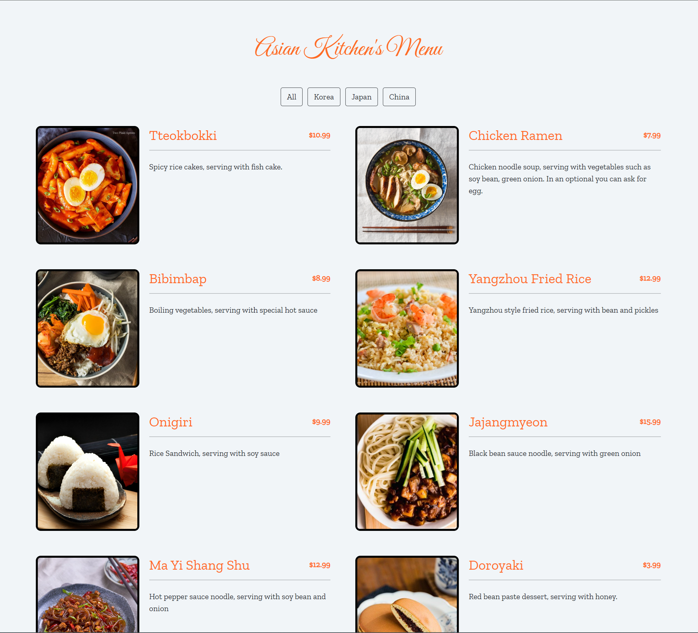
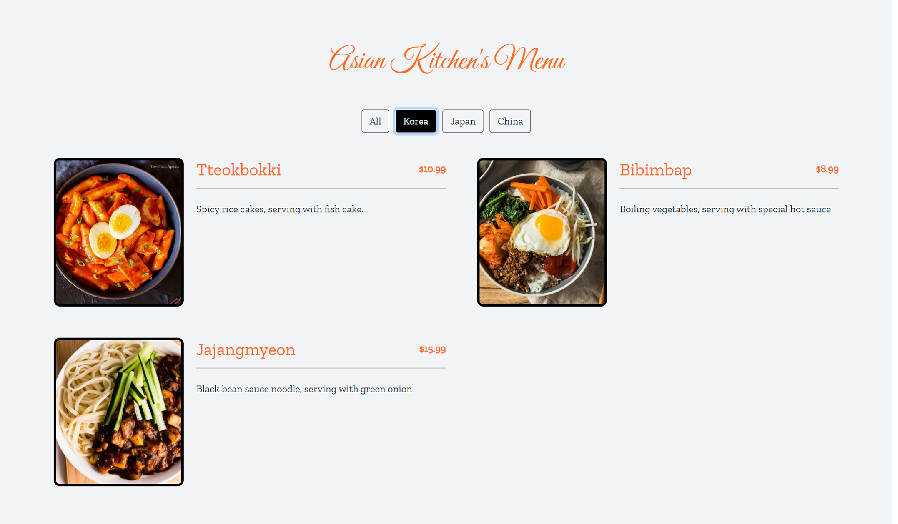

# Projeye ait ekran goruntusu:

---

## Asya Mutfagi JavaScript Odevi

Kullanicilarin belirli bir kategorilere gore yemekleri filtreleyip goruntuleyebilecegi bir web uygulamasidir.

---

### Ana Ozellikleri

- Kullanici sitede ki butun yemekleri goruntuleyebilir veya sitede bulunan kategorilere gore ayri ayri filtreleyebilir.

---

### Kullanilan Teknolojiler

**HTML5:** Sayfanin yapisini olusturmak icin kullanildi.

**CSS3:** Sayfanin gorsel tasarimini olusturmak icin kullanildi.

**JavaScript:** Uygulamanin interaktif ozelliklerini saglamak icin kullanildi.

**Bootstrap (5.2.3):** Ikonlari ve bildirim ozellikleri icin kullanildi.

---

### Yazmis oldugum kodlari asagida bulabilirsiniz:

- HMTL kodlari: [index.html](index.html)
- JavaScript kodlari: [app.js](app.js)
- CSS kodlari: [style.css](css/style.css)
