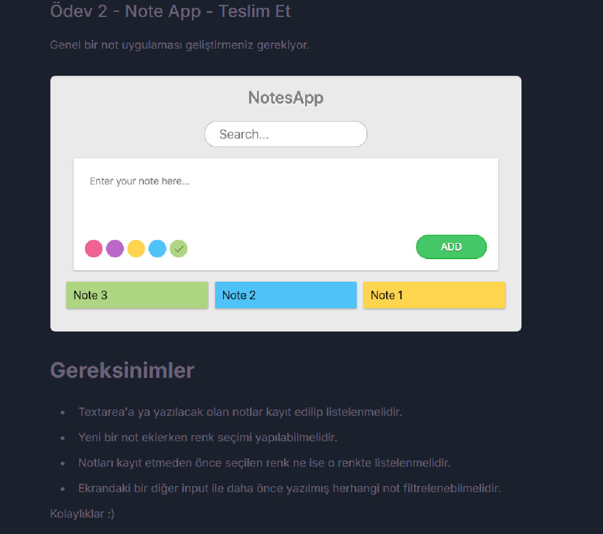

# Projenin görüntüsü:

## Not Uygulaması

## Kullanılan Teknolojiler

- React JS: Kullanıcı arayüzleri oluşturmak için bir JavaScript kütüphanesi.
- JavaScript: Mantık ve işlevsellik için.
- HTML/Tailwind CSS: Temel yapı ve stil için.
