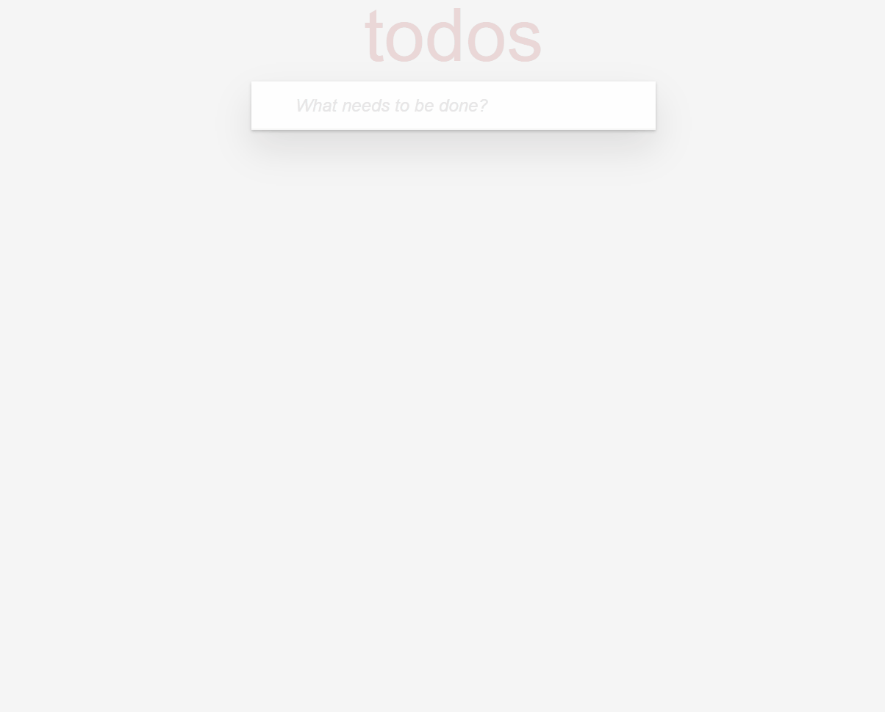

# Projenin görüntüsü:

## ToDo App

Patika Front End Bootcamp 12. Hafta ödevinin bir parçası olarak oluşturulmuştur.

## Kullanılan Teknolojiler

- React JS: Kullanıcı arayüzleri oluşturmak için bir JavaScript kütüphanesi.
- JavaScript: Mantık ve işlevsellik için.
- HTML/CSS: Temel yapı ve stil için.
