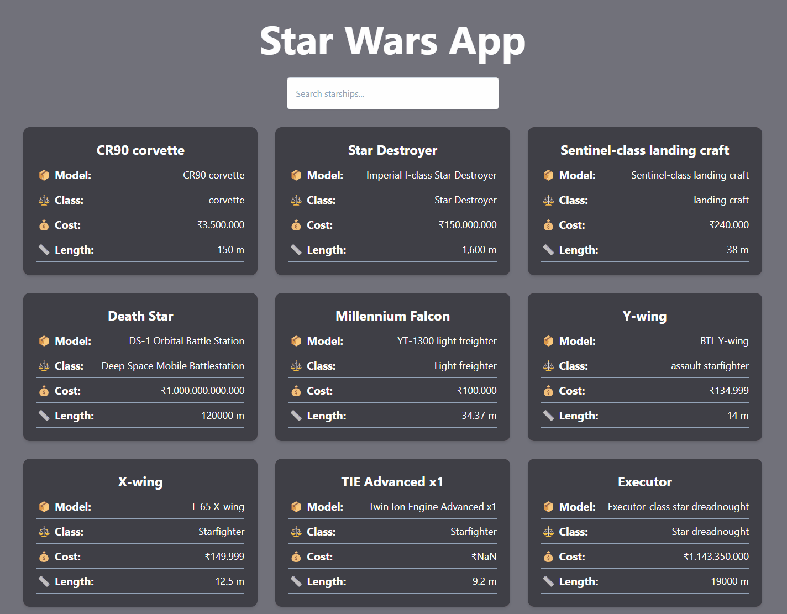

# Projenin görüntüsü:

# Yıldız Savaşları Yıldız Gemileri

Bu proje Patika Front End Bootcamp, 12. hafta için bir ödev olarak geliştirilmiştir.

Bu proje, Star Wars evreninden çeşitli yıldız gemilerini görüntüleyen etkileşimli bir web uygulamasıdır. Kullanıcılar yıldız gemilerini arayabilir ve üzerine tıklayarak her yıldız gemisi hakkında ayrıntılı bilgi görüntüleyebilir.

## Özellikler

- Yıldız Savaşları API'sinden (SWAPI) yıldız gemisi verilerini alır.
- Yıldız gemilerini isme göre filtrelemek için arama işlevi.
- Tailwind CSS kullanan modern bir kullanıcı arayüzü ile duyarlı tasarım.
- Seçilen yıldız gemileri hakkında ayrıntılı bilgi görüntülemek için modal arayüz.
