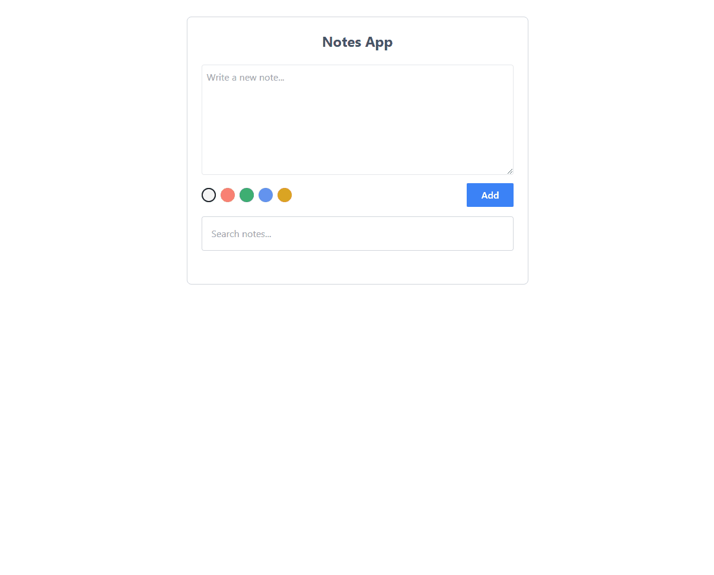
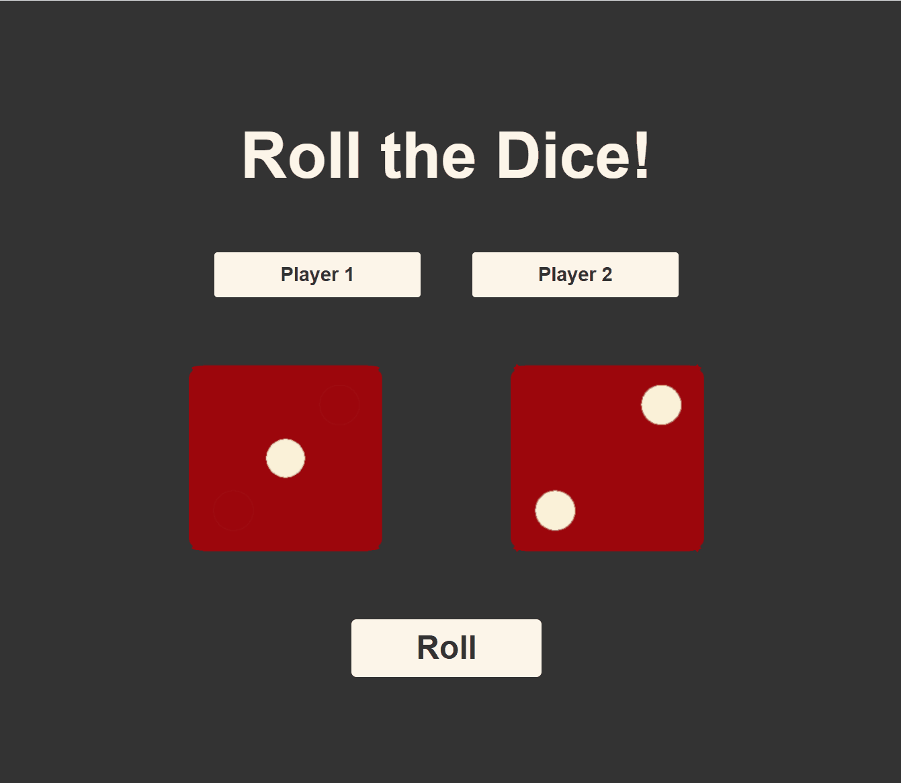
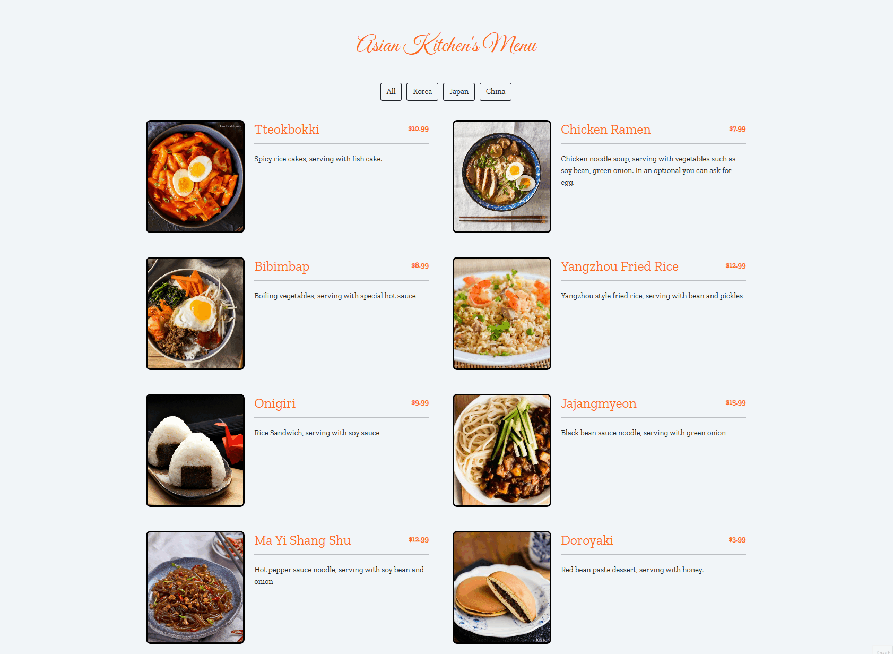

# Patika-Front-End-Web-Developer-Bootcamp

Weekly contents and tasks of the Frontend development training I received from Patika+. If you want to examine what I did and what I learned, you can click on the links.

> :date: **12.Week:**
>
> - :white_check_mark: **[1.Assignment](https://github.com/KeskenRidvan/Patika-Front-End-Web-Developer-Bootcamp/tree/main/12_Week/01_Assignment/todo-app)** 
>
> - :white_check_mark: **[2.Assignment](https://github.com/KeskenRidvan/Patika-Front-End-Web-Developer-Bootcamp/tree/main/12_Week/02_Assignment/star-wars)** 

> :date: **11.Week:**
>
> - :white_check_mark: **[1.Assignment](https://github.com/KeskenRidvan/Question-App)** 

> :date: **10.Week:**
>
> - :white_check_mark: **[1.Assignment](https://github.com/KeskenRidvan/Patika-Front-End-Web-Developer-Bootcamp/tree/main/10_Week/01_Assignment/bill-gates)** 
>
> - :white_check_mark: **[2.Assignment](https://github.com/KeskenRidvan/Question-App)** 

> :date: **09.Week:**
>
> - :white_check_mark: **[1.Assignment In week 8, the same task was done with react js.](https://github.com/KeskenRidvan/Patika-Front-End-Web-Developer-Bootcamp/tree/main/09_Week/01_Assignment)** 
>
> - :white_check_mark: **[2.Assignment](https://github.com/KeskenRidvan/Patika-Front-End-Web-Developer-Bootcamp/tree/main/09_Week/02_Assignment)** 

> :date: **08.Week:**
>
> - :white_check_mark: **[1.Assignment](https://github.com/KeskenRidvan/SportCenter)** 

> :date: **07.Week:**
>
> - :white_check_mark: **[1.Assignment](https://github.com/KeskenRidvan/iPhone15-Site-Apple)** 

> :date: **06.Week:**
>
> - :white_check_mark: **[1.Assignment](https://github.com/KeskenRidvan/Patika-Front-End-Web-Developer-Bootcamp/tree/main/06_Week/01_Assignment)** 
>
> - :white_check_mark: **[2.Assignment](https://github.com/KeskenRidvan/Patika-Front-End-Web-Developer-Bootcamp/tree/main/06_Week/02_Assignment)** 

> :date: **05.Week:**
>
> - :white_check_mark: **[1.Assignment](https://github.com/KeskenRidvan/Patika-Front-End-Web-Developer-Bootcamp/tree/main/05_Week/01_Assignment)** 
>
> - :white_check_mark: **[2.Assignment](https://github.com/KeskenRidvan/Patika-Front-End-Web-Developer-Bootcamp/tree/main/05_Week/02_Assignment)** 

> :date: **04.Week:**
>
> - :white_check_mark: **[1.Assignment](https://github.com/KeskenRidvan/Patika-Front-End-Web-Developer-Bootcamp/tree/main/04_Week/01_Assignment)** 
>
> - :white_check_mark: **[2.Assignment](https://github.com/KeskenRidvan/Patika-Front-End-Web-Developer-Bootcamp/tree/main/04_Week/02_Assignment)** 

> :date: **03.Week:**
>
> - :white_check_mark: **[1.Assignment](https://github.com/KeskenRidvan/Patika-Front-End-Web-Developer-Bootcamp/tree/main/03_Week/01_Assignment)** 
>
> - :white_check_mark: **[2.Assignment](https://github.com/KeskenRidvan/Patika-Front-End-Web-Developer-Bootcamp/tree/main/03_Week/02_Assignment)** 
>
> - :white_check_mark: **[3.Assignment](https://github.com/KeskenRidvan/Patika-Front-End-Web-Developer-Bootcamp/tree/main/03_Week/03_Assignment)** 

> :date: **02.Week:**
>
> - :white_check_mark: **[1.Assignment](https://github.com/KeskenRidvan/Patika-Front-End-Web-Developer-Bootcamp/tree/main/02_Week/01_Assignment)** 
>
> - :white_check_mark: **[2.Optional Assignment](https://github.com/KeskenRidvan/Patika-Front-End-Web-Developer-Bootcamp/tree/main/02_Week/02_OptionelAssignment)** 
>
> - :white_check_mark: **[3.Assignment](https://github.com/KeskenRidvan/Patika-Front-End-Web-Developer-Bootcamp/tree/main/02_Week/03_Assignment_02)** 

> :date: **01.Week:**
>
> - :white_check_mark: **[1.Practice](https://github.com/KeskenRidvan/Patika-Front-End-Web-Developer-Bootcamp/tree/main/01_Week/01_Practice)**
> - :white_check_mark: **[2.Practice](https://github.com/KeskenRidvan/Patika-Front-End-Web-Developer-Bootcamp/tree/main/01_Week/02_Practice)**
> - :white_check_mark: **[1.Assignment](https://github.com/KeskenRidvan/Patika-Front-End-Web-Developer-Bootcamp/tree/main/01_Week/03_Assignment_01)**
> - :white_check_mark: **[2.Assignment](https://github.com/KeskenRidvan/Patika-Front-End-Web-Developer-Bootcamp/tree/main/01_Week/04_Assignment_02)**
> - :white_check_mark: **[3.Assignment](https://github.com/KeskenRidvan/Patika-Front-End-Web-Developer-Bootcamp/tree/main/01_Week/05_Assignment_03)**

> :date: **Pr.-Work:**
>
> - :white_check_mark: **[1.Assignment](https://github.com/KeskenRidvan/Patika-Front-End-Web-Developer-Bootcamp/tree/main/00_Pre-Work/01_Assignment)**
